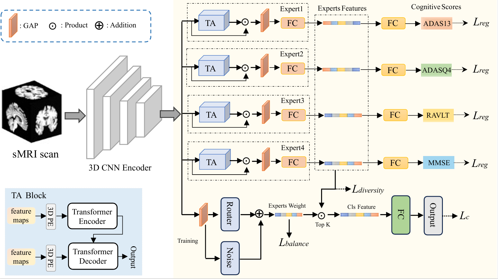

# Cognition-Guided Dynamic Multi-Expert Fusion for Image-Level Representation Learning in Alzheimer's Disease Diagnosis

## Abstract

In the clinical diagnosis of Alzheimer's disease (AD), cognitive assessments are typically combined with neuroimaging. However, cognitive scores, as phenotypic indicators, cannot reflect the corresponding imaging biomarkers. Therefore, a straightforward fusion of cognitive scores and imaging features is insufficient to fully capture their intrinsic associations, thereby limiting the interpretability of image-based diagnosis. To address this issue, this study explores how to incorporate supervisory information from cognitive assessments while preserving the independence of image-based diagnosis and proposes a dynamic multi-expert fusion (DMEF) framework to enhance diagnostic performance. The framework consists of multiple experts that obtain the output features from a shared convolutional neural network (CNN) encoder and improve their feature representation capabilities under the guidance of their respective regression tasks. Meanwhile, a gating network integrates the outputs of experts, enabling dynamic selection of critical expert features based on input samples to achieve discriminative representations of imaging features. Experimental results show that our proposed method achieves stable and superior performance in AD diagnosis. At the same time, visualization analyses further confirm its effectiveness in capturing imaging biomarkers associated with AD and preserving the clinical physical significance of image-based diagnosis.

## Model Architecture



## Usage

This project includes two classification experiment directories:

- `ADvsCN/`: AD vs. CN classification
- `pMCIvssMCI/`: pMCI vs. sMCI classification

The two directories share the same code structure. The workflow below uses `ADvsCN/` as an example.

### 1. Configure config

Edit [config.py](ADvsCN/config.py) in the corresponding directory and adjust the following parameters to your data environment:

- `--train_root_path` / `--val_root_path` / `--test_root_path`: paths to the train/val/test datasets
- `--excel_file`: path to the Excel file storing cognitive score information
- `--batch_size`, `--nepoch`, `--gpu`, `--device`, and other training-related parameters

### 2. Run the training script

Run the training script inside the corresponding directory:

```bash
cd ADvsCN
python train_double_plus.py --gpu 0 --batch_size 8 --nepoch 90
```

After training, the model weights (`.pt`) will be saved to the result directory.

### 3. Test the model

Set `--model_path` in [config.py](ADvsCN/config.py) to the model weight file to be tested, then run:

```bash
python test_model.py
```

The script will output metrics including ACC, SEN, SPE, and AUC on the test set.

## Requirements

- Python 3.8+
- PyTorch
- torchvision
- numpy
- pandas
- matplotlib
- tqdm
- scikit-learn
- opencv-python
- SimpleITK
- nibabel

Installation example:

```bash
pip install torch torchvision numpy pandas matplotlib tqdm scikit-learn opencv-python SimpleITK nibabel
```
